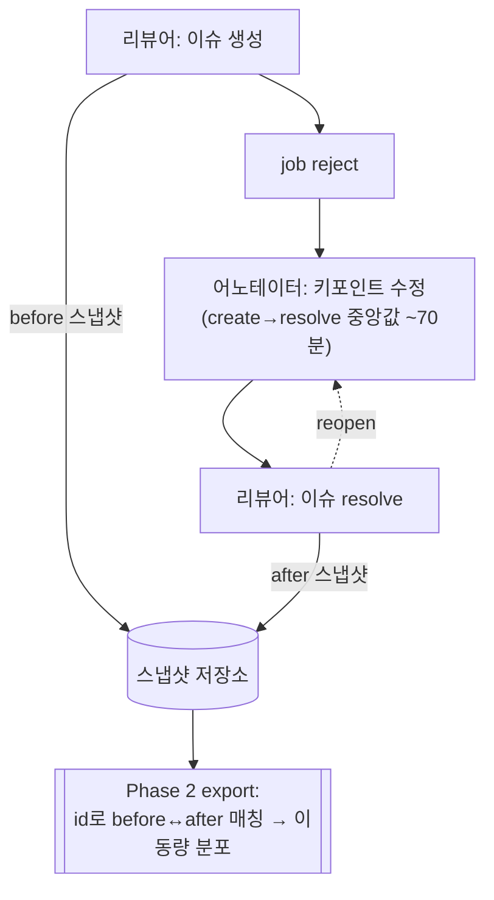

# 리뷰 이슈 교정 스냅샷 캡처 (Phase 1)

## Summary

리뷰 이슈가 **생성될 때**와 **resolve될 때**, 그 프레임의 densify된 어노테이션 상태(플레인 shape + 보간된 track)를 서버에서 스냅샷으로 남긴다. 기존 피드백 텍스트(Comment)와 짝지어 `나쁜 키포인트 → 피드백 → 고친 키포인트` before/after 데이터를 축적한다. Phase 1은 **캡처·축적·관찰**까지만 — export는 만들지 않는다.

## Problem Frame

목표는 키포인트 **자동교정 모델**(나쁜 좌표를 입력받아 고친 좌표를 출력) 학습용 데이터셋을 모으는 것이다. 재료의 세 조각 중 텍스트 피드백은 이미 `Comment`로 존재하지만, **before/after 키포인트 상태는 현재 어디에도 저장되지 않는다.**

- 어노테이션에 **히스토리/버전 관리가 없다** — 저장 시 DB row를 덮어쓴다. 이벤트 로그에도 좌표가 없다.
- 따라서 이슈 생성 시점의 "나쁜" 상태도, resolve 시점의 "고친" 상태도 **사후에 복원할 방법이 없다.**
- 즉 캡처를 붙이기 전에 resolve되는 모든 이슈의 before/after는 **영구 소실**된다. 가치가 증명된 지금, 매일 데이터가 버려지고 있다.

이 워크플로우가 실제 교정 데이터를 만든다는 전제는 프로덕션 데이터로 검증됐다(아래 Sources). 남은 유일한 미측정 항목 — 교정 시 키포인트가 기하학적으로 얼마나 움직이는지의 분포 — 은 히스토리 부재로 사후 측정이 불가능하며, **앞으로 캡처해야만** 나온다. 이것이 Phase 1을 지금 배포해야 하는 이유다.

## Key Decisions

- **이슈↔shape 직접 연결 대신 프레임 전체 스냅샷.** 리뷰어 워크플로우를 전혀 바꾸지 않는다. 대가로 "이 피드백 ↔ 정확히 이 키포인트"의 귀속이 느슨해지며, before↔after 매칭은 export(Phase 2)로 미룬다.
- **서버사이드 캡처 + 백엔드 기존 보간 재사용.** track은 DB에 키프레임만 저장하므로, 프레임의 raw row를 조회하면 보간 프레임의 track이 누락·오기된다. export가 쓰는 것과 동일한 per-frame densify 경로를 재사용해 프레임 N의 정확한 좌표(스켈레톤 element 포함)를 얻는다.
- **프레임 전체를 통째로 캡처, 필터는 export에서.** 히스토리가 없어 놓친 타입은 소급 불가이고, densify 뷰는 어차피 전 타입을 반환한다. 벡터 타입을 통째로 담고, **mask는 저장량(RLE 픽셀 데이터) 때문에 제외**한다.
- **diff가 아닌 원본 기하 저장.** export 형태가 미정이라 원재료를 유연하게 남긴다.
- **매 resolve 전이를 캡처**(reopen→재resolve 포함). 캡처 시점엔 그게 "최종" resolve인지 알 수 없으므로 전부 남기고, 마지막을 고르는 판단은 export로 미룬다.
- **Phase 1은 캡처·관찰만, export는 Phase 2.** 캡처는 비가역(안 하면 매일 소실)이고, export는 가역이며 실데이터를 봐야 잘 설계된다.

## Requirements

**캡처 트리거**

- R1. 리뷰 이슈가 생성되면, 그 이슈 프레임의 어노테이션 상태를 "before" 스냅샷으로 캡처한다.
- R2. 이슈가 unresolved→resolved로 전이하면 "after" 스냅샷을 캡처한다. 모든 전이를 캡처한다(reopen 후 재resolve 시 추가로 남긴다).

**스냅샷 내용**

- R3. 스냅샷은 이슈 프레임의 densify된 per-frame 뷰 — 플레인 shape + 보간된 track(스켈레톤 element 각각 포함) — 를 담는다. 프레임에 키프레임이 없는 track도 보간된 좌표로 기록된다.
- R4. 캡처 대상은 모든 벡터 타입(skeleton, rectangle, polygon, points, polyline, ellipse, cuboid)이며, mask는 제외한다.
- R5. 각 객체는 identity(shape id / track id), geometry(points), 키포인트 플래그(occluded, outside), rotation, label, type을 보존한다 — 나중에 before/after 쌍과 키포인트별 delta를 복원할 수 있을 만큼.
- R6. 각 스냅샷은 소속 issue, phase(before/after), frame, job, 캡처 시각을 기록한다.

**완전성·견고성**

- R7. 캡처는 서버사이드에서 일어나, 어떤 클라이언트가 이슈를 생성·해결했든 누락 없이 잡힌다.
- R8. 스냅샷 실패가 이슈 생성/해결 동작 자체를 실패시키거나 눈에 띄게 지연시켜선 안 된다.
- R9. 스냅샷은 diff 없이 원본 기하 그대로 축적된다.

**관찰 가능성 (Phase 1의 목표)**

- R10. 축적되는 스냅샷은 조회 가능해야 한다 — 건수 확인, 그리고 object identity로 before↔after를 짝지어 교정을 눈으로 확인하고 키포인트 이동량을 측정할 수 있어야 한다.

## Key Flows

- F1. Before 캡처
  - **Trigger:** 리뷰 이슈가 생성됨(서버사이드).
  - **Steps:** 이슈 프레임의 densify된 per-frame 뷰를 읽어(벡터 타입만, 보간 track 포함) before 스냅샷으로 이슈에 연결해 저장.
  - **Outcome:** 나쁜 상태 저장됨.
  - **Covers:** R1, R3, R4, R5, R6, R7.
- F2. After 캡처
  - **Trigger:** 이슈 `resolved`가 false→true로 전이.
  - **Steps:** 동일한 densify 읽기 → after 스냅샷(phase=after)으로 이슈에 연결해 **추가 저장**(기존 after를 덮어쓰지 않음).
  - **Outcome:** 고친 상태 저장됨. object identity로 before↔after 짝지음 가능.
  - **Covers:** R2, R3, R4, R5, R6, R7.

## Acceptance Examples

- AE1. **보간 track.** 이슈 프레임에 키프레임이 없는 track이 있을 때 → 스냅샷은 비어있지 않고, 그 프레임의 **보간 좌표**를 기록한다. (R3)
- AE2. **스켈레톤 track.** 스켈레톤이 track일 때 → 각 키포인트 element의 보간 좌표 + occluded/outside가 개별 기록된다. (R3, R5)
- AE3. **reopen 후 재resolve.** 이슈가 resolve→reopen→재resolve되면 → after 스냅샷이 2개 기록된다. (R2)
- AE4. **mask 존재.** 프레임에 mask 어노테이션이 있어도 → mask는 건너뛰고 나머지 벡터 shape는 정상 캡처된다. (R4)
- AE5. **빈 프레임.** 캡처 대상 타입이 하나도 없는 프레임에서 이슈가 생성되면 → before 스냅샷은 빈 집합으로 기록되며 에러를 내지 않는다. (R3)
- AE6. **캡처 실패.** 스냅샷 저장이 실패해도 → 이슈 생성/해결은 정상 완료된다. (R8)

## Success Criteria

- 캡처 배포 이후 생성/해결되는 이슈에 대해 스냅샷이 정상 생성되고, 플레인 shape와 보간 track이 올바른 좌표로 잡힌다(예: 프레임 16250 같은 알려진 케이스로 검증).
- before↔after를 object identity로 짝짓고 키포인트별 delta를 스크립트로 계산할 수 있다 → 지금껏 못 재던 **키포인트 이동량 분포**를 산출 가능.
- 캡처가 리뷰 동작(생성/해결)을 깨거나 눈에 띄게 늦추지 않는다.
- Phase 1 "완료" = 데이터가 깨끗이 축적되고 조회 가능함. Phase 2(export) 착수의 go/no-go는 관찰된 이동량 분포로 판단한다.

## Scope Boundaries

**Phase 2로 미룸 (실 스냅샷을 본 뒤 설계)**

- export 출력 경로 전체: before↔after 매칭, diff 계산, 데이터셋 포맷(예: COCO-keypoints 확장), 전달 수단.
- 학습 샘플에 프레임 이미지/크롭 픽셀 포함 여부.
- 삭제-재생성으로 id가 바뀐 객체의 공간 fallback 매칭.

**이 기능의 정체성 밖**

- 리뷰어/어노테이터 UI 변경, 이슈↔특정 shape 명시적 연결.
- 텍스트 피드백 ↔ 특정 키포인트의 1:1 귀속.
- mask 캡처.

## Dependencies / Assumptions

- **백엔드 보간 재사용:** dataset_manager의 기존 per-frame densify(`AnnotationManager` / `TrackManager.to_shapes`, `get_interpolated_shapes`)를 재사용한다. 클라이언트 보간은 불필요.
- **피드백 텍스트:** 이미 이슈의 `Comment`로 존재. 변경 불필요.
- **후속 매칭 가정:** before↔after 매칭은 shape id / track id가 제자리 수정 동안 유지된다는 가정에 기댄다. 삭제-재생성은 id 매칭을 깨뜨린다(Phase 2에서 공간 fallback으로 처리). 데이터가 쌓이면 **삭제-재생성 비율**을 측정할 가치가 있다.
- **저장량:** 이슈 수 × 2 스냅샷 × 프레임 객체 수에 비례. 유한하며, mask 제외로 폭증을 억제.
- **전제 검증됨(아래 Sources):** resolve가 대규모로 사용되고, create→resolve에 실제 수정 창이 존재하며, 해결자가 생성자와 다르고, reject 사이클을 동반한다 — 실제 어노테이터 교정이 일어난다.

## Outstanding Questions

**Deferred to Planning**

- 스냅샷 저장 위치·스키마(신규 테이블 vs JSON 필드), 인덱스, 보존 정책.
- 서버 훅 지점: 이슈 생성 캡처와 resolve 전이 캡처를 어디에 붙일지, resolve 전이를 어떻게 안정적으로 감지할지.
- 단일 프레임 densify를 효율적으로 얻는 호출 방식(`included_frames={N}`).

**Phase 1 데이터를 본 뒤 재검토 (product)**

- 학습 샘플에 이미지/크롭이 필요한가 — 자동교정 모델의 시각 근거 문제. 실 이동량 분포·샘플 수를 보고 Phase 2에서 결정.

## Sources / Research

**전제 검증 (프로덕션 데이터)**

- create→resolve 지연(③): 전체 중앙값 70.2분, 관측 윈도우(2026-03-20~07-06) 중앙값 1.95시간, 관측 윈도우 내 즉시해결(<10초) 0%. resolved 이슈 95,664건.
- 해결자 ≠ 생성자: 99.8%(자가해결 0.2%). reject 사이클 동반: 78.8%.
- 같은 프레임 다중 이슈는 생성·해결이 각각 한 세션에 몰림(생성 간격 중앙값 20.4초, 해결 간격 28.6초) — create→resolve 지연과는 독립. 즉 "몰아서 생성/해결"이지 "before/after가 없다"가 아님.

**코드 breadcrumbs**

- Issue/Comment 모델: `cvat/apps/engine/models.py:1243-1291`. Issue엔 shape 링크 없음(frame+position만); `Comment.message`가 피드백 텍스트.
- 어노테이션 히스토리 없음(덮어쓰기); 이벤트 로그에 좌표 없음.
- Track 키프레임 저장: `LabeledTrack`/`TrackedShape` `cvat/apps/engine/models.py:1214-1225` (keyframe DB 컬럼 없음).
- 재사용할 백엔드 보간: `TrackManager.get_interpolated_shapes` `cvat/apps/dataset_manager/annotation.py:715`; 스켈레톤 element 보간 `TrackManager.to_shapes` `annotation.py:565`; per-frame densify 경로 `bindings.py` `group_by_frame → AnnotationManager.to_shapes`.
- Shape 타입(rectangle·mask 포함) `models.py:1143-1151`; `Shape.points/outside/occluded/bbox` `models.py:1187-1198`.
- 이슈 생성 훅 후보: `IssueWriteSerializer.create` `cvat/apps/engine/serializers.py:3474-3479`; resolve는 이슈 update(`IssueViewSet` / `serverProxy.issues.update`).
