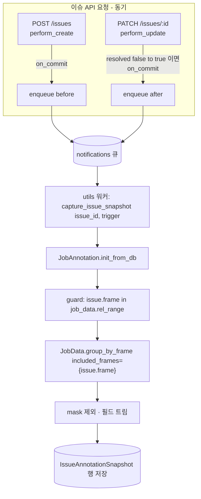

# feat: Capture before/after annotation snapshots around review issues (Phase 1)

## Summary

리뷰 이슈가 생성될 때(before)와 resolve될 때(after) 그 프레임의 densify된 어노테이션 기하를 서버에서 스냅샷해 신규 저장소에 축적한다. 캡처는 이슈 API 동작 커밋 후 워커에서 비동기로 돌며, track 보간은 `dataset_manager`의 기존 per-frame 경로를 재사용한다. export·매칭·이미지는 이 계획 범위 밖(Phase 2)이다.

---

## Problem Frame

키포인트 자동교정 데이터셋의 세 재료 중 텍스트 피드백은 `Comment`로 이미 존재하지만, before/after 키포인트 상태는 어디에도 저장되지 않는다. 어노테이션에 히스토리가 없어(덮어쓰기) 이슈 생성·해결 시점의 기하를 사후 복원할 수 없으므로, 캡처를 붙이기 전에 resolve되는 모든 이슈의 before/after는 영구 소실된다. 전제(실제 어노테이터 교정이 일어남)는 프로덕션 데이터로 검증됐다(origin의 Sources 참조). 남은 미측정 항목 — 키포인트 이동량 분포 — 은 앞으로 캡처해야만 나온다. Phase 1의 목적은 이 소실을 멈추고 데이터를 축적·관찰하는 것이며, 형태·포맷 결정이 필요한 export는 실데이터를 본 뒤 Phase 2로 미룬다. (see origin: `docs/brainstorms/2026-07-07-review-issue-correction-snapshots-requirements.md`)

---

## Requirements

**캡처 트리거**

- R1. 리뷰 이슈가 생성되면 그 이슈 프레임의 어노테이션 상태를 before 스냅샷으로 캡처한다.
- R2. 이슈 `resolved`가 false→true로 전이할 때마다 after 스냅샷을 캡처한다(reopen 후 재resolve 시 추가로 남긴다).

**스냅샷 내용**

- R3. 스냅샷은 이슈 프레임의 densify된 per-frame 뷰 — 플레인 shape + 보간된 track(스켈레톤 element 포함) — 를 담는다. 프레임에 키프레임이 없는 track도 보간 좌표로 기록된다.
- R4. 캡처 대상은 모든 벡터 타입(skeleton, rectangle, polygon, points, polyline, ellipse, cuboid)이며 mask는 제외한다.
- R5. 각 객체는 identity(shape id / track id), `group`, points, occluded, outside, rotation, label, type을 보존하고, 스켈레톤은 element별로 sublabel 이름·points·occluded·outside를 보존한다 — COCO Keypoints의 키포인트 순서·visibility·bbox 페어링(R11)을 나중에 복원할 수 있을 만큼.
- R6. 각 스냅샷 행은 소속 issue, job, trigger(before/after), frame(=Issue.frame, task-relative), 캡처 시각을 기록한다.

**완전성·견고성**

- R7. 캡처는 서버사이드에서, 이슈 API의 생성·해결 경로에 걸려 동작한다.
- R8. 캡처 실패(densify 오류, 워커 예외, 브로커 오류)가 이슈 생성/해결 HTTP 동작을 실패시키거나 눈에 띄게 지연시키지 않는다.
- R9. 스냅샷은 diff 없이 원본 densify 기하 그대로 축적된다.

**Export 포맷 정합 (구현은 Phase 2, 포맷은 지금 확정)**

- R11. 캡처 `data`는 COCO Keypoints 파생 **교정 포맷**(한 레코드에 `수정 전 + 피드백 스레드 + (리젝된 중간 시도들) + 최종 수정 후`; 부록 참조)을 손실 없이 만들 수 있는 상위집합이어야 한다 — object별 `group`, 스켈레톤 element별 sublabel 이름과 occluded/outside(visibility 도출원), rectangle(bbox 소스). before·(중간)·final은 각 resolve 전이 스냅샷에서, 피드백은 이슈 `Comment` 스레드에서 조인(캡처 불필요).

**관찰 가능성 (Phase 1 목표)**

- R10. 축적된 스냅샷은 조회 가능해야 한다 — trigger·job별 건수 확인, 그리고 object identity로 한 이슈의 before↔after를 짝지어 덤프할 수 있어야 한다(정량 이동량 계산은 이 덤프를 소비하는 후속 스크립트 몫 — origin Success Criteria와 일치).

---

## Key Technical Decisions

- **densify 경로 재사용, raw 모델 조회 금지 (R3):** 프레임 N의 기하는 `JobAnnotation(job_id).init_from_db()` → `JobData(annotation_ir=..., db_job=..., included_frames={rel_n}).group_by_frame(include_empty=True)`로 얻는다. track은 DB에 키프레임만 있으므로 raw 조회는 보간 프레임을 놓친다. 이 경로는 export가 쓰는 것과 동일(`AnnotationManager.to_shapes` → `TrackManager.get_interpolated_shapes`)하며 스켈레톤 element까지 재귀 보간한다.
- **프레임 좌표 (최대 리스크):** `Issue.frame`, `included_frames`, `group_by_frame`의 `frame.idx`는 모두 동일한 task-relative 좌표(`JobData.rel_range = range(segment.start_frame, segment.stop_frame+1)`)다. 따라서 `issue.frame`을 변환 없이 `included_frames={issue.frame}`로 넘긴다. `rel_frame_id`는 media-absolute→relative 변환기(`divmod(absolute_id − start_frame, frame_step)`, 나머지 있으면 `ValueError`)라 여기 쓰면 안 된다 — `frame_step≠1`이나 `data.start_frame≠0`에서 `ValueError`를 던지고 R8이 그 예외를 삼켜 **조용히 무캡처**가 된다. 방어적으로 `if issue.frame in job_data.rel_range`로 가드해 miss(삭제/제외 프레임)면 no-op. 좌표 동일성이 여전히 최대 리스크이므로 `frame_step≠1`/`start_frame≠0` 잡으로 검증한다.
- **비동기 캡처 (R8):** 이슈 동작 커밋 후 `transaction.on_commit`으로 `notifications` 큐(→ `cvat_worker_utils_everex`)에 enqueue하고, 워커가 `issue_id`+trigger만 받아 재로드한다. `init_from_db()`가 잡 전체 어노테이션을 로드하므로 in-request 동기 캡처는 큰 잡에서 지연을 유발한다. 대가: 워커 지연 시 before 드리프트 가능(어노테이터는 median ~70분 뒤 고치므로 낮음). `webhooks/signals.py`의 on_commit+enqueue 선례를 따른다.
- **훅 위치 = 이슈 API 뷰셋 (R7):** `IssueViewSet.perform_create`(before), `perform_update`(resolve 전이)를 오버라이드한다. `perform_update`는 `super()` 호출 전 `serializer.instance.resolved` 값을 캡처해 호출 후와 비교한다(선례: `TaskViewSet.perform_update`). 백업/임포트로 DB에 직접 대량 생성되는 이슈는 캡처하지 않는다(정상 리뷰 이슈는 모두 API 경유).
- **신규 저장소 `IssueAnnotationSnapshot`:** `TimestampedModel` 상속, `issue` FK(CASCADE), `job` FK(CASCADE, R10의 job별 집계용), `trigger`, `frame`, `data`(stock `JSONField`, Postgres jsonb). 이슈당 여러 행 허용(before 1+ · after N). `QualityReport`의 "워커가 JSON blob을 도메인 객체에 키잉해 저장" 패턴을 미러.
- **mask 제외 (R4):** densify 결과에 mask가 포함되므로 캡처 코드에서 `type == "mask"`를 필터한다.
- **원본 기하 저장, 매칭·diff 없음 (R9):** before↔after 매칭·diff·전달·이미지는 Phase 2. 지금은 densify 뷰를 그대로 직렬화해 축적만 한다(목표 포맷은 아래 KTD로 확정).
- **Export 목표 = COCO Keypoints 파생 교정 포맷 (확정) (R11):** 최종 산출물은 vanilla COCO가 아니라, COCO Keypoints 구조(images·categories)를 물려받되 각 레코드가 **수정 전 키포인트 + 피드백 텍스트 + 수정 후 키포인트**를 함께 담는 교정 포맷이다(부록에 스키마 확정). export 구현은 Phase 2지만 이 포맷을 지금 못박아, Phase 1 캡처가 그 상위집합을 빠짐없이 담게 한다. `keypoints_before`/`_after`는 before·after 스냅샷 element에서(visibility는 occluded/outside, 순서는 sublabel; 여러 resolve면 마지막 after), `bbox_before`/`_after`는 같은 `group`의 rectangle에서, `feedback`은 이슈 `Comment` 스레드에서(export 시 issue_id로 조인), image·category는 task/label 정의에서 얻는다. 좌표·visibility·bbox 매핑은 기존 exporter(`dataset_manager/formats/coco.py`, datumaro `coco_person_keypoints`)의 규칙을 재사용한다.

---

## High-Level Technical Design



`perform_update`의 전이 판정은 저장 전후 비교로만 결정된다: `was_resolved = serializer.instance.resolved` → `super().perform_update()` → `if not was_resolved and serializer.instance.resolved: enqueue`. 그 외 필드만 바뀐 PATCH나 true→false(reopen)에서는 enqueue하지 않는다.

---

## Implementation Units

### U1. IssueAnnotationSnapshot 모델 + 마이그레이션

- **Goal:** 스냅샷을 이슈에 키잉해 저장하는 신규 테이블을 추가한다.
- **Requirements:** R6, R9, R10
- **Dependencies:** 없음
- **Files:**
  - `cvat/apps/engine/models.py` (신규 `IssueAnnotationSnapshot(TimestampedModel)`)
  - `cvat/apps/engine/migrations/0099_issueannotationsnapshot.py` (신규; `dependencies = [("engine", "0098_add_skeleton_bbox")]`)
  - `cvat/apps/engine/tests/test_issue_snapshot_model.py` (신규)
- **Approach:** 필드 — `issue = FK(Issue, related_name="annotation_snapshots", on_delete=CASCADE)`, `job = FK(Job, related_name="issue_annotation_snapshots", on_delete=CASCADE)`(R10 job별 집계용), `trigger = CharField(choices=[("before",...),("after",...)])`, `frame = PositiveIntegerField()`(`Issue.frame` 그대로 복사; task-relative), `data = models.JSONField()`. `created_date`는 `TimestampedModel`에서 온다. unique 제약 없음 — 이슈당 다중 행 허용(before 1개 이상, resolve 전이마다 after 추가). `issue`·`job`에 인덱스. `Issue` 모델(`models.py:1243`)과 `QualityReport`(`quality_control/models.py:91-196`)를 미러.
- **Patterns to follow:** `TimestampedModel`(`models.py:442-450`); `QualityReport` `CreateModel` 마이그레이션(`quality_control/migrations/0001_initial.py:80-124`); 최신 스타일 `engine/migrations/0098_add_skeleton_bbox.py`.
- **Test scenarios:**
  - 마이그레이션 정합성: `makemigrations --check`가 신규 마이그레이션 반영 후 clean.
  - 다중 행: 한 이슈에 before 1 + after 2 행을 만들 수 있고 모두 조회된다.
  - CASCADE: 이슈 삭제 시 연결된 스냅샷 행이 함께 삭제된다.
- **Verification:** 마이그레이션이 적용되고, 셸에서 이슈에 스냅샷 행 여러 개를 생성·조회할 수 있다.

### U2. 캡처 서비스 (densify → 필터 → 직렬화 → 저장)

- **Goal:** `issue_id`와 trigger를 받아 프레임의 densify된 벡터 기하를 스냅샷 행으로 영속화하는 순수 함수.
- **Requirements:** R3, R4, R5, R6, R9, R11
- **Dependencies:** U1
- **Files:**
  - `cvat/apps/engine/issue_snapshots.py` (신규; `capture_issue_snapshot(issue_id, trigger)`와 프레임→직렬화 헬퍼)
  - `cvat/apps/engine/tests/test_issue_snapshot_capture.py` (신규)
- **Approach:** `Issue`를 로드(없으면 조용히 no-op — 삭제된 이슈). `JobAnnotation(issue.job_id).init_from_db()` → `JobData(annotation_ir=ja.ir_data, db_job=ja.db_job, included_frames={issue.frame})`. **`issue.frame`을 변환 없이 그대로 넘긴다**(가드: `if issue.frame not in job_data.rel_range: return`; `rel_frame_id` 쓰지 않음 — KTD 참조). `group_by_frame(include_empty=True)`의 해당 프레임 `labeled_shapes`를 순회하며 `type == "mask"`를 제외하고, 각 shape/track에서 R5 필드 집합만 트림한 dict 리스트를 만든다(스켈레톤은 `elements` 재귀). `IssueAnnotationSnapshot(issue=issue, job=issue.job, trigger=..., frame=issue.frame, data={"objects": [...]})` 저장. 반환된 `LabeledShape`/`TrackedShape` 네임드튜플 필드는 `bindings.py:220-252`. `outside` track은 densify 경로가 이미 제외.
- **Technical design (directional):** 저장 payload 개형 — `{"frame": <task-rel>, "objects": [{"id", "track_id"?, "type", "label", "group", "points", "rotation", "occluded", "outside", "elements": [{"sublabel", "points", "occluded", "outside"}]}, ...]}`. `group`·element `sublabel`은 R11(COCO Keypoints 상위집합)용. 최종 필드 선정은 구현 시 확정(directional).
- **Patterns to follow:** export densify 경로 `JobAnnotation.export`(`dataset_manager/task.py:814-836`)와 `CommonData.group_by_frame`(`dataset_manager/bindings.py:506`); `included_frames` 필터(`annotation.py:779,787`).
- **Test scenarios:**
  - Covers AE1. 이슈 프레임에 키프레임이 없는 rectangle track → 스냅샷 objects에 그 프레임의 **보간** 좌표가 포함(빈 값 아님).
  - Covers AE2. 스켈레톤 track → 각 키포인트 element의 보간 좌표 + occluded/outside가 `elements`에 들어감.
  - Covers AE4. 프레임에 mask가 있어도 mask는 제외되고 나머지 벡터 shape는 포함.
  - Covers AE5. 대상 타입이 없는 빈 프레임 → `objects: []`로 저장, 예외 없음.
  - 플레인 shape(rectangle/points/polygon) happy path: id·type·label·points·flags가 원본과 일치.
  - Covers R11. 스켈레톤과 같은 `group`의 rectangle이 각각 `group`을 달고 캡처되고, 스켈레톤 element에 sublabel 이름·occluded·outside가 담겨 COCO Keypoints 순서·visibility·bbox 페어링을 복원할 수 있다.
  - 프레임 좌표: `frame_step≠1` 또는 `data.start_frame≠0`인 잡에서 `issue.frame`로 호출해도 올바른 프레임이 잡히고 `ValueError`·무캡처가 없다(스텝/오프셋 픽스처 — 단순 멀티세그먼트로는 이 축을 못 잡는다).
  - 삭제된 이슈 id → no-op(행 미생성, 예외 없음).
- **Verification:** 알려진 프레임(예: 16250 성격의 케이스)에서 함수를 호출해 저장된 `data.objects`가 눈으로 보간 좌표·스켈레톤 element·mask 제외를 만족.

### U3. 워커 태스크 + 뷰셋 훅 (enqueue)

- **Goal:** 이슈 생성·resolve 전이에서 캡처를 비동기로 트리거한다.
- **Requirements:** R1, R2, R7, R8
- **Dependencies:** U2
- **Files:**
  - `cvat/apps/engine/issue_snapshots.py` (enqueue 헬퍼 + `notifications` 큐로 도는 워커 진입 함수 추가)
  - `cvat/apps/engine/views.py` (`IssueViewSet`에 `perform_create` 확장 · `perform_update` 신규, `views.py:2134-2173`)
  - `cvat/apps/engine/tests/test_issue_snapshot_hooks.py` (신규)
- **Approach:** `perform_create`: 기존 `serializer.save(owner=...)` 후 `transaction.on_commit(lambda: enqueue(issue.pk, "before"))`. `perform_update`: `was_resolved = serializer.instance.resolved` → `super().perform_update(serializer)` → `if not was_resolved and serializer.instance.resolved: transaction.on_commit(lambda: enqueue(issue.pk, "after"))`. enqueue 헬퍼는 `django_rq.get_queue(settings.CVAT_QUEUES.NOTIFICATIONS.value).enqueue(...)`로 `capture_issue_snapshot`를 호출하되, enqueue 호출과 워커 태스크 모두 예외를 잡아 로깅만 한다(R8 — 이슈 동작은 이미 커밋됨). 인자는 `issue_id`+trigger만.
- **Patterns to follow:** old/new 비교 `TaskViewSet.perform_update`(`views.py:946-957`); on_commit+enqueue `webhooks/signals.py:272-275`, `add_to_queue`(`signals.py:91-93`); 큐 상수 `settings/base.py:268-277`.
- **Test scenarios:**
  - Covers R1. `POST /issues` → 커밋 후 before enqueue 1건(모의 큐로 검증), 스냅샷 1행.
  - Covers R2. resolved=false 이슈를 `resolved=true`로 PATCH → after enqueue 1건.
  - Covers AE3. resolve→reopen(true→false)→재resolve(false→true) → after 스냅샷 2행(reopen 시엔 enqueue 없음).
  - 비전이 업데이트: `position`/`assignee`만 바뀐 PATCH나 이미 resolved인 이슈 재저장 → after enqueue 없음.
  - Covers R8. 캡처 함수가 예외를 던져도 `POST`/`PATCH`는 2xx로 성공하고 이슈 상태는 정상 반영.
- **Verification:** 로컬 스택에서 이슈를 만들고 resolve하면 utils 워커 로그에 캡처 실행이 찍히고 스냅샷 행이 생긴다. 캡처 함수를 일부러 실패시켜도 이슈 API는 정상.

### U4. 관찰 도구 (management command)

- **Goal:** 축적 현황을 확인하고 한 이슈의 before/after를 덤프하는 경량 수단(Phase 1의 "관찰").
- **Requirements:** R10
- **Dependencies:** U1
- **Files:**
  - `cvat/apps/engine/management/commands/issue_snapshots_report.py` (신규)
  - `cvat/apps/engine/tests/test_issue_snapshot_report.py` (신규)
- **Approach:** 인자 없이 실행 시 trigger·job별 스냅샷 건수와 before/after 쌍을 가진 이슈 수를 출력. `--issue <id>`면 그 이슈의 before/after `data.objects`를 object id로 정렬해 나란히 덤프(같은 shape/track id의 좌표 변화를 눈으로 확인). 순수 조회, 부작용 없음.
- **Patterns to follow:** 기존 `cvat/apps/engine/management/commands/` 커맨드 구조.
- **Test scenarios:**
  - 집계: before/after 섞인 픽스처에서 건수·페어 이슈 수가 정확.
  - `--issue`: before와 after가 object id로 매칭돼 출력되고, id가 안 맞는(삭제-재생성) 객체는 unmatched로 표시.
- **Verification:** 커맨드 실행 결과가 DB의 스냅샷 행 수와 일치하고, `--issue`로 특정 이슈의 before/after가 나란히 보인다.

---

## Acceptance Examples

- AE1. **보간 track:** 키프레임 없는 프레임의 track이 보간 좌표로 캡처된다(빈 값 아님). — U2
- AE2. **스켈레톤 track:** 각 키포인트 element의 보간 좌표 + occluded/outside가 개별 기록된다. — U2
- AE3. **reopen 후 재resolve:** after 스냅샷이 2개 기록되고, reopen 시점엔 캡처가 없다. — U3
- AE4. **mask 존재:** mask는 제외되고 나머지 벡터 shape는 캡처된다. — U2
- AE5. **빈 프레임:** 대상 타입이 없으면 빈 objects로 저장되고 예외가 없다. — U2
- AE6. **캡처 실패 격리:** 스냅샷 저장 실패에도 이슈 생성/해결은 정상 완료된다. — U3 (R8)

---

## Scope Boundaries

**Phase 2로 미룸 (실 스냅샷을 본 뒤 설계)**

- export 출력 경로 **구현**: before↔after 매칭, diff 계산, 전달 수단. (목표 포맷은 COCO Keypoints 파생 교정 포맷으로 확정 — R11·부록 참조; 미루는 건 구현뿐.)
- 학습 샘플의 이미지/크롭 픽셀 포함 여부.
- 삭제-재생성으로 id가 바뀐 객체의 공간 fallback 매칭(U4는 unmatched로 표시만).

**이 기능의 정체성 밖**

- 리뷰어/어노테이터 UI 변경, 이슈↔특정 shape 명시적 연결.
- 텍스트 피드백 ↔ 특정 키포인트 1:1 귀속.
- mask 캡처.

### Deferred to Follow-Up Work

- 백업/임포트로 대량 생성되는 이슈의 캡처(현재 API 훅은 이를 잡지 않음). 필요 시 DB 시그널 방식으로 확장.

---

## System-Wide Impact

- **DB:** 신규 테이블 1개. 이슈 생성·resolve당 스냅샷 행이 늘며(before 1 + after N), mask 제외로 행 크기 억제. 무한 증가가 아니라 이슈 볼륨에 비례. **보존 정책: Phase 1은 자동 purge 없음** — 실제 축적량(U4 집계)을 본 뒤 재검토한다(origin이 planning으로 미룬 항목의 명시적 결정).
- **워커:** `notifications` 큐(→ `cvat_worker_utils_everex`)에 캡처 잡이 추가된다. 캡처당 잡 전체 어노테이션 1회 로드 비용 — 큰 잡에서 워커 시간이 증가하나 요청 경로는 평평.
- **API 계약:** 변화 없음. 캡처는 클라이언트에 비가시.
- **UI:** 변화 없음.

---

## Risks & Dependencies

- **프레임 좌표 오처리(최고 리스크):** `Issue.frame`을 media-absolute로 오인해 `rel_frame_id`로 변환하면 `frame_step≠1`/`start_frame≠0` 잡에서 `ValueError`→(R8이 삼켜)무캡처. 완화: 변환 없이 `issue.frame` 직접 사용 + `rel_range` 가드, `frame_step≠1`/`start_frame≠0` 잡으로 테스트.
- **큐 지연 → before 드리프트:** 워커가 밀리면 before가 어노테이터 편집 이후 상태로 찍힐 수 있음. 현 데이터상 위험 낮음(수정은 수 분~수 시간 뒤). 완화: Phase 1 관찰로 감시, 심하면 before만 동기 캡처로 전환.
- **id 안정성(Phase 2 의존):** before↔after 매칭은 shape/track id가 제자리 수정 동안 유지된다는 가정. 삭제-재생성 비율은 축적 데이터로 측정(U4의 unmatched 카운트가 1차 신호).
- **대량 임포트 우회:** API 훅은 백업 복원 이슈를 놓친다(의도적, Deferred 참조).
- **의존:** `dataset_manager`의 densify 경로(`JobAnnotation`/`JobData`/`TrackManager`), django-rq `notifications` 큐, Postgres jsonb.

---

## Appendix: Export 목표 포맷 (COCO Keypoints 파생 교정 포맷)

Phase 2 산출물의 **확정 스키마** (구현은 Phase 2; 여기선 형태만 못박아 Phase 1 캡처가 상위집합을 담게 한다). `images`·`categories`는 COCO Keypoints 그대로, `corrections[]`의 각 레코드가 한 스켈레톤의 before/after/feedback을 함께 담는다.

```json
{
  "images": [
    { "id": 1, "file_name": "frame_016250.PNG", "width": 1920, "height": 1080,
      "job": { "id": 42, "state": "completed", "stage": "acceptance" } }
  ],
  "categories": [
    { "id": 1, "name": "person",
      "keypoints": ["nose", "left_eye", "right_eye"], "skeleton": [[1, 2], [1, 3]] }
  ],
  "corrections": [
    { "id": 100, "image_id": 1, "category_id": 1,
      "issue_id": 98552,
      "feedback": [
        { "author": "reviewer_kim",  "message": "오른쪽 눈 위치 어긋남 — occluded 처리 필요", "created": "2026-06-09T06:01:13Z" },
        { "author": "annotator_lee", "message": "수정했습니다", "created": "2026-06-09T06:08:00Z" },
        { "author": "reviewer_kim",  "message": "아직 x가 5px 오른쪽 — 다시", "created": "2026-06-09T06:20:00Z" },
        { "author": "annotator_lee", "message": "재수정 완료", "created": "2026-06-09T06:35:00Z" }
      ],
      "keypoints_before": [960, 400, 2,  945, 390, 2,  1010, 395, 2],
      "keypoints_after":  [960, 400, 2,  945, 390, 2,   975, 390, 1],
      "bbox_before": [900, 350, 140, 300],
      "bbox_after":  [900, 350, 120, 300],
      "num_keypoints": 3,
      "resolve_count": 2,
      "final_state": "resolved",
      "intermediate_revisions": [
        { "resolve_index": 1, "resolved_at": "2026-06-09T06:09:00Z",
          "keypoints": [960, 400, 2,  945, 390, 2,  980, 392, 2],
          "bbox": [900, 350, 125, 300] }
      ] }
  ]
}
```

매핑:
- `keypoints_before`/`keypoints_after` — 각각 before/after 스냅샷의 스켈레톤 element에서. `[x, y, v]` 삼중항, `v`: `outside→0`, `occluded→1`, else `2`. 순서는 `categories.keypoints`(=라벨 sublabel 정의).
- `bbox_before`/`bbox_after` — 같은 `group`의 rectangle `points [x1,y1,x2,y2]` → `[x1,y1,x2−x1,y2−y1]`.
- `feedback` — 이슈의 **`Comment` 스레드 전체**(첫 이슈 코멘트 + 답글들)를 시간순 배열로. `issue_id`로 조인(스냅샷엔 캡처하지 않음). 여러 번 오간 피드백이 그대로 담긴다.
- `image` — `frame`으로 task 프레임 메타(file_name/width/height) + job 메타 조회.
- **여러 번 리젝→재수정**(resolve→reopen→재resolve, N회): 초기 bad는 `keypoints_before`, 최종 승인은 `keypoints_after`, 그 사이 "resolve됐다 다시 reopen된 = 리젝된 시도"들은 `intermediate_revisions[]`(각 `resolve_index`·`resolved_at`·`keypoints`·`bbox`)에 순서대로 담긴다. `resolve_count`는 총 resolve 횟수, 단발이면 `intermediate_revisions`는 `[]`. 이렇게 두면 `(bad→시도1)`·`(시도1→시도2)`·…·`(시도n→final)` 연속 쌍을 각각 학습 샘플로 뽑을 수 있고(각 시도는 리젝된 = 아직 부족했던 상태), 각 리젝을 유발한 피드백은 `resolved_at` timestamp로 `feedback` 스레드에서 매칭한다. `after` 스냅샷을 매 전이마다 캡처(R2)하므로 이 궤적은 손실 없이 복원된다.
- **미완결 correction**: 이슈가 아직 최종 resolved 상태가 아니면(현재 열려 있음) 승인된 good이 없다 — `final_state`로 표시하고, 완결 학습쌍에서 제외하거나 "리젝된 시도들"로만 취급(Phase 2 결정).
- **한 프레임에 이슈가 여럿**: 프레임 전체 스냅샷이 겹치므로 한 스켈레톤 수정이 여러 이슈의 correction 레코드에 각기 다른 `feedback`으로 나타날 수 있다(느슨한 귀속, origin 결정). 레코드는 `issue_id`별로 생기고, 어느 피드백을 붙일지·중복 dedup은 Phase 2 매칭 과제.
- before↔after object 매칭은 shape/track id 기준(삭제-재생성은 unmatched — Phase 2 매칭 과제).

---

## Sources / Research

**전제 검증 (프로덕션 데이터, origin Sources)**

- create→resolve 지연 중앙값 70.2분(관측 윈도우 1.95시간), 관측 윈도우 내 즉시해결 0%. resolved 이슈 95,664건. 해결자≠생성자 99.8%, reject 사이클 78.8%.

**코드 breadcrumbs**

- `TimestampedModel` `cvat/apps/engine/models.py:442-450`; `Issue`/`Comment` `models.py:1243-1291`.
- Track 키프레임 저장(보간은 런타임) `LabeledTrack`/`TrackedShape` `models.py:1214-1225`.
- densify 진입점: `JobAnnotation` `cvat/apps/dataset_manager/task.py:112,804`; `JobData`/`CommonData.group_by_frame`/`included_frames` `cvat/apps/dataset_manager/bindings.py:299-319,506`; 반환 네임드튜플 `bindings.py:220-252`; `rel_frame_id`/`abs_frame_id` `bindings.py:346-357`; 보간 `TrackManager.get_interpolated_shapes` `dataset_manager/annotation.py:714`, 스켈레톤 element `annotation.py:565`.
- 이슈 훅: `IssueViewSet` `cvat/apps/engine/views.py:2134-2173`; old/new 비교 선례 `TaskViewSet.perform_update` `views.py:946-957`; `IssueWriteSerializer.create` `cvat/apps/engine/serializers.py:3474-3479`.
- 비동기 선례: `webhooks/signals.py:91-93,272-275`; 큐 상수 `cvat/settings/base.py:268-277,297-342`; utils 워커 매핑 `docker-compose.yml:122-131`.
- JSON blob 저장 템플릿: `QualityReport` `cvat/apps/quality_control/models.py:91-196`, 마이그레이션 `quality_control/migrations/0001_initial.py:80-124`.
- Export 목표 포맷(COCO Keypoints): 기존 exporter `cvat/apps/dataset_manager/formats/coco.py:225-315`(person = 스켈레톤 + group-paired rectangle bbox, `__cvat_bbox` 전송, datumaro `coco_person_keypoints`), per-image job 메타 `cvat/apps/dataset_manager/formats/_coco_job_meta.py`.
